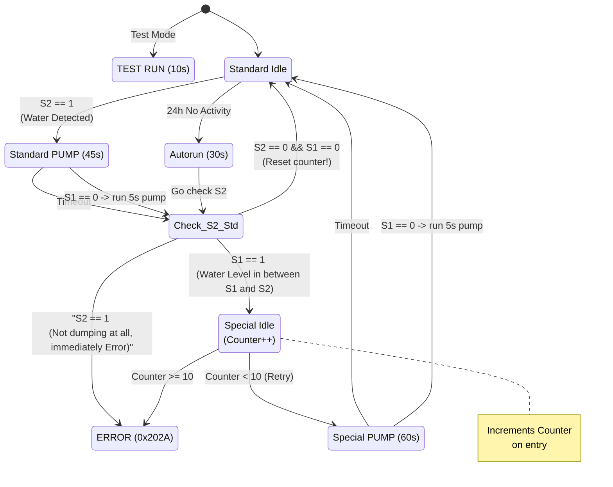

# Water Pump Control System - Firmware Logic V1.2

## 1. Overview

This module controls a **drainage water pump** based on water level sensor inputs (**S1** and **S2**). It uses a **Finite State Machine (FSM)** architecture to ensure the pump operates reliably, handles potential clogs ("Special Mode"), and performs self-maintenance ("Autorun").

### Key Hardware Abstractions:
- **S1 (Lower Sensor)**: Detects if water is present at a low level.
- **S2 (Higher Sensor)**: Detects if water has reached a critical high level (triggering the pump).
- **Pump Output**: Controlled via GPIO to turn the motor **ON** or **OFF**.

## 2. State Machine Description

The system operates in one of the following states (`g_wpState`):

### A. Standard Idle (`WP_SM_STD_IDLE`)
**Behavior**: The system waits here when the tank is empty.

**Transitions**:
- If **S2 == 1** (High Water): Transition to Standard Pump.
- If **24 Hours** pass with no activity: Transition to Autorun.

### B. Standard Pump (`WP_SM_STD_PUMP`)
**Behavior**: The pump runs to drain the water.

**Stop Conditions**:
- **Timeout**: The pump runs for **45 seconds** (Safety limit).
- **S1 Logic**: If S1 goes **HIGH** (water detected) and then drops **LOW** (water gone) for **5 continuous seconds**.

**Post-Pump Decision** (`CheckPostPump`):
- If **S1=0, S2=0** (Empty): Return to Standard Idle (Success).
- If **S1=1** (Partial Drain): Move to Special Idle (Possible clog/slow drain).
- If **S2=1** (Still Full): Critical Error (Pump failed to move water).

### C. Special Idle ("Retry Mode" - `WP_SM_SPEC_IDLE`)
**Purpose**: If the tank didn't drain completely (S1 is still high), we enter this mode to wait and retry.

**Safety Logic**: Every time we enter this state, a counter (`g_S2StuckCounter`) increments.
- If **Counter < Max**: Retry pumping (Move to Special Pump).
- If **Counter >= Max**: Error **0x202A** (Stuck/Clogged).

### D. Special Pump (`WP_SM_SPEC_PUMP`)
**Behavior**: Similar to Standard Pump, but with a longer timeout (**60 seconds**) to force water out.

**Transition**: After stopping, it always returns to Standard Idle to re-evaluate the sensors from scratch.

### E. Autorun (`WP_SM_AUTORUN`)
**Purpose**: Runs the pump for **30 seconds** every **24 hours** to prevent seizing/sediment buildup.

**Logic**: Once finished, it checks the sensors using the standard `CheckPostPump` logic to ensure no water was accidentally left behind.

## 3. Potential Error Scenarios

### Error Case 1: Pump Failure (S2 Trigger)
- **Description**: A critical mechanical failure where the pump is energized but fails to displace water. This is identified when the High-Level Sensor (S2) is triggered while the pump command is active. This indicates that the inflow rate exceeds the pump's capacity or the pump impeller is seized.
  
  Condition: $(Pump_{Status} == \text{ON}) \land (Sensor_{S2} == \text{HIGH})$

- **System Reaction**: Immediate Latch: Trigger a CRITICAL_OVERFLOW_ERROR.
  - **Actuation**: Force the pump to OFF (to prevent motor burnout if seized) or keep ON (if trying to mitigate overflow—depending on safety requirements). Standard practice is usually to stop and sound an alarm.
  - **UI/Log**: Display "Pump Failure / Overflow" and require a manual hardware reset to clear.

### Error Case 2: Pipe Clog / Incomplete Drain Cycles
- **Description**: A recurring inefficiency detected in the discharge line. The system detects that the water level remains fluctuating between the Low Limit (S1) and High Limit (S2) without successfully clearing S1. A counter increments each time the pump runs for a specific duration or cycle without reaching the "Empty" state ($< S1$).
  
  Condition: $\sum (\text{Cycles}_{incomplete}) \ge 10$

- **System Reaction**: Counter Check: When the fault counter reaches 10, trigger ERROR_PIPE_CLOG.
  - **Actuation**: Inhibit automatic pump operation to prevent short-cycling damage.
  - **UI/Log**: Alert the operator to inspect the outlet pipes for partial obstructions.

### Error Case 3: Sensor Wire Disconnection
- **Description**: A physical disconnection (Open Circuit) occurs in the wiring for sensor S1 or S2. The behavior depends on the hardware fail-safe configuration (Normally Open vs. Normally Closed).

- **System Reaction**: 
  - **If Normally Closed (NC) - Recommended**: The system reads the open circuit as a logic 0 (Alarm State).
    - **Result**: The system enters a "Safe Mode" or triggers a False Alarm immediately, ensuring the operator notices the broken wire.
  
  - **If Normally Open (NO) - Dangerous**: The system reads the open circuit as a logic 0 (Dry/Safe State).
    - **Result (S1 Break)**: The pump never starts. Tank overflows.
    - **Result (S2 Break)**: The High-Level alarm is disabled. Tank overflows without warning if the pump fails.

## 4. Logic Flow Diagram

The following diagram illustrates the state transitions and decision logic.

